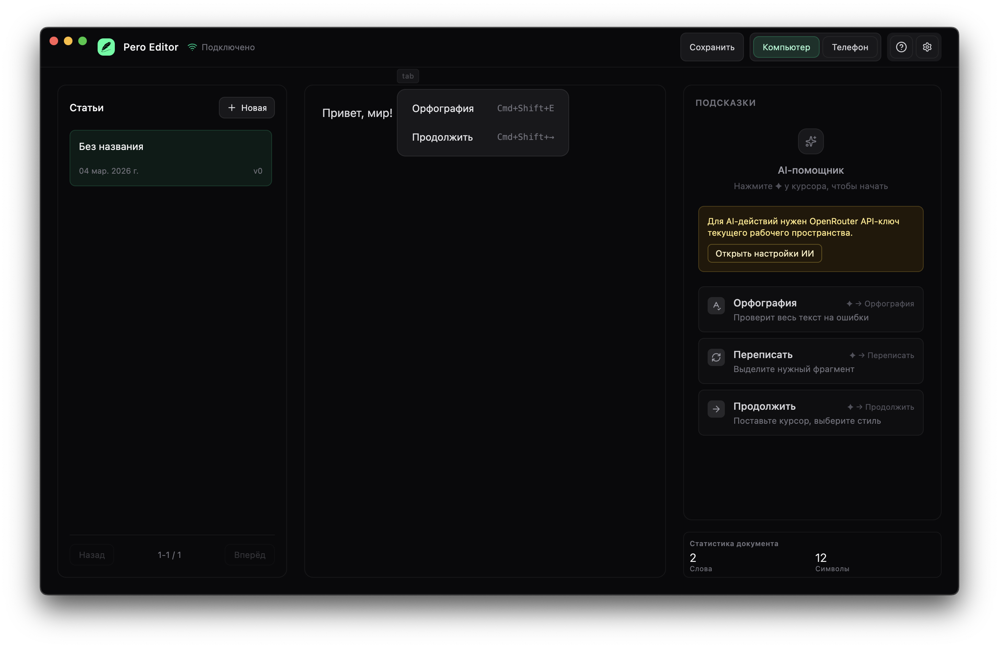

# Pero Editor

An AI-powered writing assistant for macOS. Spellcheck, rewrite, and continue your text using any LLM via [OpenRouter](https://openrouter.ai/).



## Download

**macOS** — requires macOS 12+

| Architecture | Link |
|---|---|
| Apple Silicon (M1/M2/M3) | [Pero Editor-0.1.1-arm64.dmg](https://pero-dist-dmg.website.yandexcloud.net/Pero%20Editor-0.1.1-arm64.dmg) |
| Intel (x64) | [Pero Editor-0.1.1.dmg](https://pero-dist-dmg.website.yandexcloud.net/Pero%20Editor-0.1.1.dmg) |

The app includes auto-update — new versions install automatically.

## Features

- **Rich text editor** powered by [Tiptap](https://tiptap.dev/) / ProseMirror
- **AI suggestions**: spellcheck, rewrite in 4 styles, continue writing
- **Real-time sync** with version conflict resolution (WebSocket)
- **Author post library** — sidebar with all your posts
- **Desktop & mobile preview** modes
- **Bring your own API key** — any model supported by OpenRouter

## Architecture

The project is a monorepo with three apps:

```
app-frontend/   React 19 + Vite + Tiptap + Tailwind CSS
app-backend/    Node.js + Moleculer + WebSocket + Prisma + SQLite
app-desktop/    Electron — packages frontend + backend into a macOS app
```

The desktop app bundles both the frontend and backend — no external server needed.

## Self-Hosting / Development

### Prerequisites

- Node.js 20+
- npm

### 1. Backend

```bash
cd app-backend
cp .env.example .env
# Generate a secure encryption key:
# openssl rand -hex 32
# Paste the result as AI_SECRETS_ENCRYPTION_KEY in .env
npm install
npm run db:migrate
npm run dev
```

### 2. Frontend

```bash
cd app-frontend
cp .env.example .env.local
# Set VITE_WS_URL=ws://localhost:8080
npm install
npm run dev
```

Open `http://localhost:3000` in your browser.

### 3. Desktop (Electron)

Requires the backend to be built first:

```bash
cd app-backend
npm run build

cd ../app-desktop
npm install
npm run dev
```

To build the DMG:

```bash
cd app-desktop
npm run dist
```

## AI Configuration

The app connects to [OpenRouter](https://openrouter.ai/) to access LLMs. Configure your API key and preferred model in the **AI Settings** modal inside the app (gear icon).

Supported: any model available on OpenRouter (GPT-4o, Claude, Gemini, Llama, etc.)

## Environment Variables

**app-backend/.env**

```env
AI_SECRETS_ENCRYPTION_KEY=  # 32-byte hex key: openssl rand -hex 32
```

**app-frontend/.env.local**

```env
VITE_WS_URL=ws://localhost:8080
VITE_WORKSPACE_ID=default-workspace
VITE_AUTHOR_USER_ID=default-user
VITE_POST_LIST_LIMIT=20
```

## Contributing

See [CONTRIBUTING.md](./CONTRIBUTING.md).

## License

[MIT](./LICENSE)
